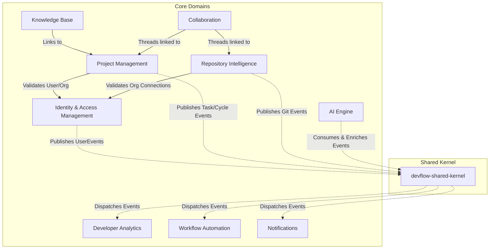

# DevFlow — Domain Model Specification

> **Version:** 1.0.0  
> **Status:** Approved / Architecture Review Board (ARB) Signed Off  
> **Author:** Principal Software Architect  
> **Date:** 2026-07-28  
> **Classification:** Internal — Engineering

---

## 1. Purpose

This document defines the **Domain Model** for DevFlow, an AI-First Engineering Intelligence & Delivery Platform. In accordance with Domain-Driven Design (DDD) principles, this specification establishes the business domain boundaries, definitions, invariants, and structural relationships before any physical database schemas, Java classes, REST APIs, or user interfaces are designed.

By delineating clear **Bounded Contexts**, **Aggregate Roots**, **Entities**, and **Value Objects**, this model ensures:
- **Conceptual Clarity:** The business vocabulary (Ubiquitous Language) is shared consistently between engineers, product managers, and AI training runs.
- **Architectural Isolation:** Maven modules mirror Bounded Contexts, preventing tight coupling and circular dependencies.
- **Data Integrity:** Transactional boundaries are enforced through Aggregate Roots, ensuring that business rules and invariants are maintained across all platform interactions.

---

## 2. Domain Overview

DevFlow’s business domain is divided into nine core **Bounded Contexts**. These contexts are logically isolated but coordinate asynchronously via a shared event-driven kernel.



---

## 3. Core Business Domains

### 3.1 Identity & Access Management (IAM)

- **Purpose:** Manages the identities of developers, the logical boundaries of their organizations (tenants), and the role-based access control (RBAC) rules that authorize operations within those boundaries.
- **Responsibilities:**
  - Authenticate users and establish secure execution contexts.
  - Define organization workspaces as hard transactional and logical boundaries.
  - Manage memberships and assign role-based permissions (RBAC).
  - Securely store OAuth installation contexts for third-party integrations (GitHub, Google).

#### Domain Model Elements

| DDD Element | Name | Description | Attributes / Fields |
| :--- | :--- | :--- | :--- |
| **Aggregate Root** | `Organization` | The fundamental tenant boundary. All business data (Projects, Repositories, Tasks) belongs to exactly one Organization. | `Id`, `Name`, `Slug`, `CreatedAt`, `Settings` |
| **Aggregate Root** | `User` | A unique human operator or developer identity across the platform. | `Id`, `Email`, `FullName`, `PasswordHash`, `Status` |
| **Entity** | `WorkspaceMembership` | The association between a `User` and an `Organization`, carrying specific system roles. | `Id`, `UserId`, `OrganizationId`, `Role` |
| **Entity** | `Role` | A collection of authorized system permissions. | `Id`, `Name`, `Permissions` |
| **Value Object** | `EmailAddress` | Encapsulates email syntax validation, normalization (lowercase), and comparison logic. | `Value` |
| **Value Object** | `Permission` | An individual operation grant (e.g., `project:create`, `task:edit`). | `Action`, `Resource` |
| **Value Object** | `OAuthConnection` | Details of a completed OAuth authorization flow for an integration. | `Provider`, `AccessToken`, `RefreshToken`, `Scopes`, `ExpiresAt` |

---

### 3.2 Project Management (PM)

- **Purpose:** Facilitates planning, scheduling, tracking, and delivery of software development work.
- **Responsibilities:**
  - Organize tasks into boards, columns, and backlogs.
  - Manage development cycles (sprints), epics, and high-level roadmaps.
  - Track task estimated effort, prioritization, and lifecycle state changes.
  - Generate unique, immutable keys for project assets.

#### Domain Model Elements

| DDD Element | Name | Description | Attributes / Fields |
| :--- | :--- | :--- | :--- |
| **Aggregate Root** | `Project` | The container for all planning and tracking assets. Projects group boards, cycles, and epics. | `Id`, `OrganizationId`, `Name`, `Key`, `Description`, `WorkflowTemplate` |
| **Aggregate Root** | `Task` | An individual unit of work. Separated from the `Project` Aggregate Root to avoid write locks and performance bottlenecks on large project boards. | `Id`, `ProjectId`, `TaskKey`, `Title`, `Description`, `Priority`, `Status`, `Estimation`, `AssigneeId`, `CreatorId`, `CycleId`, `EpicId`, `ColumnId` |
| **Entity** | `Board` | The visual board representing project progress. | `Id`, `ProjectId`, `Name` |
| **Entity** | `Column` | A vertical workflow lane representing a step in the project's task lifecycle. | `Id`, `BoardId`, `Name`, `SortOrder`, `StatusMapping` |
| **Entity** | `Cycle` | A time-boxed iteration (sprint) during which work is committed and completed. | `Id`, `ProjectId`, `Name`, `StartDate`, `EndDate`, `State` (Draft, Active, Closed) |
| **Entity** | `Epic` | A large body of work that can be broken down into multiple tasks, spanning multiple cycles. | `Id`, `ProjectId`, `Name`, `TargetDate`, `Status` |
| **Value Object** | `TaskKey` | A unique string identifier composed of the Project key and an incrementing index (e.g., `DEVF-42`). Immutable once set. | `Value` |
| **Value Object** | `TaskPriority` | Enumerated values defining work urgency. | `Low`, `Medium`, `High`, `Urgent` |
| **Value Object** | `TaskEstimation` | Effort weight represented in story points or hours. | `Value` |

---

### 3.3 Repository Intelligence (RI)

- **Purpose:** Ingests and synchronizes version control history, code changes, and review processes, parsing metadata to provide deep architectural and organizational insights.
- **Responsibilities:**
  - Coordinate the secure cloning and fetching of Git histories.
  - Map commit logs to logical author profiles and linked project tasks.
  - Monitor pull requests, branches, and patch files.
  - Expose parsed code diffs for automated code review execution.

#### Domain Model Elements

| DDD Element | Name | Description | Attributes / Fields |
| :--- | :--- | :--- | :--- |
| **Aggregate Root** | `Repository` | Represents a linked Git repository in a third-party host (e.g., GitHub, GitLab). | `Id`, `OrganizationId`, `Name`, `ExternalId`, `CloneUrl`, `DefaultBranch`, `SyncStatus` |
| **Entity** | `Commit` | A single Git commit ledger entry parsed from repository history. | `Id`, `RepositoryId`, `Hash`, `AuthorName`, `AuthorEmail`, `Message`, `CommittedAt` |
| **Entity** | `PullRequest` | An integration review container linking branch code changes to approval workflows. | `Id`, `RepositoryId`, `ExternalNumber`, `Title`, `SourceBranch`, `TargetBranch`, `Status` (Draft, Open, Merged, Closed), `AuthorId`, `Reviewers` |
| **Entity** | `CodeReview` | An AI or human-driven review session executed on a Pull Request patch. | `Id`, `PullRequestId`, `ReviewerId`, `Status` (Pending, Approved, RequestedChanges), `SubmittedAt` |
| **Value Object** | `CommitHash` | Validated SHA hexadecimal identifier representing a unique commit snapshot. | `Hash` |
| **Value Object** | `DiffStats` | Structural metrics of changes introduced in a commit or pull request. | `LinesAdded`, `LinesDeleted`, `FilesChanged` |

---

### 3.4 AI Engine

- **Purpose:** Orchestrates semantic queries, prompt formulation, LLM interaction, and vector representation indexing to provide contextual guidance and automated task enrichments.
- **Responsibilities:**
  - Manage contextual chat dialogs with developers.
  - Assemble context payloads from active project boards and repository snapshots for LLM processing.
  - Query and maintain vector embedding coordinates.
  - Manage, format, and execute Prompt templates.

#### Domain Model Elements

| DDD Element | Name | Description | Attributes / Fields |
| :--- | :--- | :--- | :--- |
| **Aggregate Root** | `ChatSession` | An interactive conversation thread between a user and the DevFlow AI assistant. | `Id`, `UserId`, `OrganizationId`, `Title`, `CreatedAt` |
| **Entity** | `ChatMessage` | A single statement inside a `ChatSession`, representing user query or AI response. | `Id`, `ChatSessionId`, `Role` (User, Assistant, System), `Content`, `CreatedAt` |
| **Entity** | `PromptTemplate` | A versioned template with placeholders used to format prompts sent to LLMs. | `Id`, `Name`, `TemplateBody`, `Version` |
| **Value Object** | `Embedding` | High-dimensional floating-point array representing text segments semantically. | `Dimensions`, `Coordinates` |
| **Value Object** | `TokenUsage` | Tracking metric of token consumption for audit logs and API billing calculations. | `InputTokens`, `OutputTokens`, `Cost` |

---

### 3.5 Knowledge Base (KB)

- **Purpose:** Stores, organizes, and versions internal project documentations and references, linking raw files to tasks and projects.
- **Responsibilities:**
  - Create and edit wiki pages, articles, and documentation.
  - Structure documents hierarchically using folders and categories.
  - Keep historical revisions of wiki pages.
  - Index document text for semantic search extraction.

#### Domain Model Elements

| DDD Element | Name | Description | Attributes / Fields |
| :--- | :--- | :--- | :--- |
| **Aggregate Root** | `Document` | A documentation page or wiki article. | `Id`, `OrganizationId`, `ProjectId`, `Title`, `Slug`, `FolderId`, `CreatedAt`, `LastModifiedAt` |
| **Entity** | `DocumentRevision` | A historical version record capturing document content mutations. | `Id`, `DocumentId`, `Content`, `AuthorId`, `VersionNumber`, `CreatedAt` |
| **Entity** | `Folder` | A logical directory structure grouping related documents. | `Id`, `OrganizationId`, `ProjectId`, `Name`, `ParentFolderId` |
| **Value Object** | `DocumentContent` | The Markdown structure of the document, validating body constraints. | `Text` |

---

### 3.6 Developer Analytics

- **Purpose:** Aggregates delivery events, task velocities, and repository activities to calculate team output, efficiency patterns, and system health baselines (e.g., DORA).
- **Responsibilities:**
  - Compile metrics regarding development throughput and cycle times.
  - Formulate DORA delivery metrics based on project and repository data.
  - Compute contributor activity logs.
  - Store read-only historical metric snapshots.

#### Domain Model Elements

| DDD Element | Name | Description | Attributes / Fields |
| :--- | :--- | :--- | :--- |
| **Aggregate Root** | `MetricSnapshot` | A read-only snapshot capturing performance vectors over an exact time interval (daily, weekly). | `Id`, `OrganizationId`, `ProjectId`, `IntervalStart`, `IntervalEnd`, `Type` |
| **Value Object** | `DoraMetrics` | The four core metrics of DevOps performance. | `DeploymentFrequency`, `LeadTimeForChanges`, `MeanTimeToRecover`, `ChangeFailureRate` |
| **Value Object** | `VelocityMetrics` | Performance indicators of project task completion speeds. | `CycleTime`, `LeadTime`, `StoryPointsCompleted`, `Throughput` |
| **Value Object** | `ContributorActivity` | Summary of work units assigned to and completed by an individual developer. | `UserId`, `CommitsCount`, `PrsMergedCount`, `TasksResolvedCount` |

---

### 3.7 Workflow Automation

- **Purpose:** Monitors system operations to trigger and execute user-defined, conditional automation pipelines (e.g., transitioning boards when PRs merge).
- **Responsibilities:**
  - Define automation rules linked to event triggers and execution conditions.
  - Orchestrate automated mutations on Tasks, Projects, and PRs.
  - Record execution logs for rules validation.

#### Domain Model Elements

| DDD Element | Name | Description | Attributes / Fields |
| :--- | :--- | :--- | :--- |
| **Aggregate Root** | `AutomationRule` | Defines a trigger event, evaluation conditions, and execution operations. | `Id`, `OrganizationId`, `ProjectId`, `Name`, `IsEnabled`, `Trigger`, `Condition`, `Actions` |
| **Entity** | `AutomationExecution` | Log trace recording a single rule execution flow and its output status. | `Id`, `RuleId`, `TriggeredAt`, `Status` (Success, Failed, Skipped), `ErrorMessage` |
| **Value Object** | `TriggerCriteria` | Event types monitored by the automation engine (e.g., `TaskStatusChanged`, `PrMerged`). | `EventName`, `PayloadFilters` |
| **Value Object** | `ConditionGroup` | Boolean logic evaluations executed to validate rule triggers. | `Operators`, `Expressions` |
| **Value Object** | `ActionDefinition` | The execution operation to perform (e.g., `MoveTaskColumn`, `AssignUser`). | `ActionType`, `Parameters` |

---

### 3.8 Collaboration

- **Purpose:** Supports contextual dialogues, discussions, and reactions between developers across all system assets.
- **Responsibilities:**
  - Host nested commenting streams attached to Tasks, Pull Requests, or Documents.
  - Manage reactions on specific comment nodes.
  - Parse text strings to identify and register collaborator mentions.

#### Domain Model Elements

| DDD Element | Name | Description | Attributes / Fields |
| :--- | :--- | :--- | :--- |
| **Aggregate Root** | `CommentThread` | Group of comments linked to a specific platform entity (e.g., `Task:102`, `PullRequest:45`). | `Id`, `OrganizationId`, `TargetType`, `TargetId`, `IsResolved` |
| **Entity** | `Comment` | An individual text comment within a thread. | `Id`, `ThreadId`, `ParentCommentId`, `AuthorId`, `Body`, `CreatedAt`, `LastModifiedAt` |
| **Entity** | `Reaction` | A simple user-initiated emoji reaction to a comment. | `Id`, `CommentId`, `UserId`, `EmojiCode` |
| **Value Object** | `Mention` | A link to a system user identifier parsed from comment text (e.g., `@johndoe`). | `UserId`, `StartIndex`, `EndIndex` |

---

### 3.9 Notifications

- **Purpose:** Manages the routing, formatting, and delivery of alerts and notifications to users based on system events and preferences.
- **Responsibilities:**
  - Route messages to multiple channels (In-App, Email, Slack, Discord).
  - Format messages using templates appropriate for the channel.
  - Manage user preferences and notification suppression.

#### Domain Model Elements

| DDD Element | Name | Description | Attributes / Fields |
| :--- | :--- | :--- | :--- |
| **Aggregate Root** | `Notification` | A single dispatched notification representing a business event (e.g., task assignment). | `Id`, `UserId`, `OrganizationId`, `Title`, `Message`, `DeepLink`, `Status` (Unread, Read), `CreatedAt` |
| **Aggregate Root** | `NotificationPreference` | User configurations defining which events trigger dispatches on which channels. | `Id`, `UserId`, `OrganizationId`, `EventChannels` |
| **Value Object** | `NotificationChannel` | The delivery medium for the notification. | `InApp`, `Email`, `Slack`, `Discord` |
| **Value Object** | `DeliveryPayload` | The compiled string or JSON format of the notification message. | `Subject`, `BodyText`, `HtmlText` |

---

## 4. Domain Relationships

In DevFlow, domains interact primarily through **Domain Events** to preserve loose coupling. Below is a detailed mapping of interactions followed by a diagram of context boundaries.

### 4.1 Relationship Directory
- **IAM → PM & RI (Downstream Customer-Supplier):** PM and RI query IAM to validate organizational boundaries and membership permissions.
- **PM ↔ RI (Bidirectional Association via ID):** Tasks can link to one or more Commits or Pull Requests to trace execution. To prevent coupling, they only refer to each other by ID (`TaskId` and `CommitHash`/`PullRequestId`). 
- **KB ↔ PM (ID Linkage):** Documents in the Knowledge Base can link to Tasks, referring to them via `TaskId`.
- **AI Engine ──► PM, RI, KB (Downstream Reader):** The AI Engine acts as a consumer of Project, Git, and Document contexts. It ingests entity details to build vector embeddings and prompt contexts.
- **Collaboration ──► PM, RI, KB (Generic Subdomain):** Discussion threads are linked to Tasks, Pull Requests, or Documents using target types and IDs, keeping collaboration logic decoupled from the parent business rules.
- **Developer Analytics ◄── PM, RI (Publisher-Subscriber):** Analytics is a downstream observer. It subscribes to `TaskCreatedEvent`, `TaskStatusChangedEvent`, `CommitParsedEvent`, and `PullRequestMergedEvent` to construct metric dashboards.
- **Workflow Automation ◄── PM, RI (Publisher-Subscriber):** The automation engine listens to system events, evaluates rules, and triggers mutations on the target aggregate roots.
- **Notifications ◄── All Modules (Publisher-Subscriber):** Responds to event emissions (e.g., `TaskAssignedEvent`, `CommentAddedEvent`) to format and dispatch notifications.

### 4.2 Bounded Context Map

```mermaid
graph TD
    %% Relationships with labels
    IAM["Identity & Access Management (IAM)"]
    PM["Project Management (PM)"]
    RI["Repository Intelligence (RI)"]
    AI["AI Engine"]
    KB["Knowledge Base (KB)"]
    CO["Collaboration (CO)"]
    DA["Developer Analytics (DA)"]
    WA["Workflow Automation (WA)"]
    NO["Notifications (NO)"]

    PM -->|Upstream / Supplier| IAM
    RI -->|Upstream / Supplier| IAM
    
    PM -.->|Linked by ID| RI
    KB -.->|Linked by ID| PM

    AI -->|Read context (ACL)| PM
    AI -->|Read context (ACL)| RI
    AI -->|Read context (ACL)| KB

    CO -->|Links to| PM
    CO -->|Links to| RI
    CO -->|Links to| KB

    DA -->|Subscribes to events| PM
    DA -->|Subscribes to events| RI

    WA -->|Subscribes & Mutates| PM
    WA -->|Subscribes & Mutates| RI

    NO -->|Subscribes to events| PM
    NO -->|Subscribes to events| RI
    NO -->|Subscribes to events| CO
```

---

## 5. Business Rules & Invariants

This section formalizes the core business constraints that DevFlow must enforce, categorized by domain context.

### 5.1 Multi-Tenancy & Security Rules
1. **Strict Organization Isolation:** An `Organization` represents a hard tenant boundary. Under no circumstances may queries, searches, or AI vector similarity operations scan data outside the currently authenticated `OrganizationId`.
2. **Membership Authorization:** A user cannot edit, create, or comment on any Project, Task, Repository, or Document unless they have an active `WorkspaceMembership` in the parent `Organization`.

### 5.2 Project Management Rules
1. **Unique Project Keys:** A Project Key (e.g., `DEVF`) is unique within an Organization and immutable once the Project is created.
2. **Atomic Task Keys:** A Task Key must be composed of the Project Key and a sequential index (e.g., `DEVF-42`). This index is generated atomically and must be unique within the Project.
3. **Task Lifecycle Contiguity:** A Task must reside in exactly one `Column` on a `Board` belonging to the same Project.
4. **Valid Cycle Scope:** A Task can only be assigned to a `Cycle` if the Cycle belongs to the parent `Project` and is in a `Draft` or `Active` state. Completed Cycles are closed to new task assignments.
5. **Assignee Membership:** A Task can only be assigned to a User who has a valid and active `WorkspaceMembership` within the parent `Organization`.

### 5.3 Repository Intelligence Rules
1. **Secure Integration Binding:** A `Repository` cannot be registered or synced unless the Organization has established a valid `OAuthConnection` or installation token for the Git host.
2. **Commit Lineage:** A `Commit` cannot exist without a parent `Repository` ID.
3. **Pull Request Boundary:** A `PullRequest` must reference exactly one `Repository`.

### 5.4 AI Engine Rules
1. **Tenant Vector Search Isolation:** A semantic search query on vector embeddings must include a hard filter on the active `OrganizationId`. Embedding matching must never cross tenant boundaries.
2. **Context Budget Limits:** Prompts sent to external LLMs must compute and validate their `TokenUsage` before execution to prevent exceeding organizational cost limits or context window lengths.

### 5.5 Collaboration & Notification Rules
1. **Comment Thread Ancestry:** A `Comment` must belong to exactly one `CommentThread` and must inherit the read access rights of the Thread’s target entity (e.g., if a user cannot view `Task:123`, they cannot view or post comments in its comment thread).
2. **Preferential Delivery Channel:** Notifications must respect the user's `NotificationPreference` configurations. If a channel (e.g., Slack) is deactivated for an event, delivery must be bypassed.

---

## 6. Domain Ownership

The Bounded Contexts mapped in this Domain Model correspond directly to the Multi-Module Maven structure of DevFlow, ensuring architectural boundaries are checked during compilation and build processes.

| Bounded Context | Maven Module | Core Aggregates Owned by Module |
| :--- | :--- | :--- |
| **Identity & Access Management (IAM)** | `devflow-auth` | `User`, `Organization` |
| **Project Management (PM)** | `devflow-project-management` | `Project`, `Task` |
| **Repository Intelligence (RI)** | `devflow-repository-intelligence` | `Repository` |
| **AI Engine** | `devflow-ai-engine` | `ChatSession` |
| **Knowledge Base (KB)** | `devflow-knowledge-base` | `Document` |
| **Developer Analytics** | `devflow-developer-analytics` | `MetricSnapshot` |
| **Workflow Automation** | `devflow-workflow-automation` | `AutomationRule` |
| **Collaboration** | `devflow-collaboration` | `CommentThread` |
| **Notifications** | `devflow-notifications` | `Notification`, `NotificationPreference` |
| **Cross-Cutting Kernel** | `devflow-shared-kernel` | Contains shared Value Objects (e.g., `EmailAddress`), base abstractions (e.g., `BaseEntity`), and shared events (e.g., `DomainEvents`). |

---

## 7. Future Expansion

DevFlow is designed to support the introduction of future features without requiring structural changes to the core Domain Model:

- **Billing & Subscriptions Domain:** Will introduce a `devflow-billing` module. The core domain will treat Billing as downstream. It will listen to organizational events (e.g., `OrganizationCreatedEvent`, `UserAddedEvent`) to manage subscription plans and meter usage. Core domains remain decoupled from payment processing.
- **Marketplace Domain:** Will introduce a `devflow-marketplace` module. Third-party extensions can be published and registered against an Organization. This context will interact with the core domain via public APIs, utilizing a plugin adapter layer.
- **Plugin System / Extensions Domain:** Will register external system adapters that listen to events emitted via the shared kernel (e.g., using Webhooks) and invoke public API contracts, allowing DevFlow’s functionality to be extended without modifying core modules.
