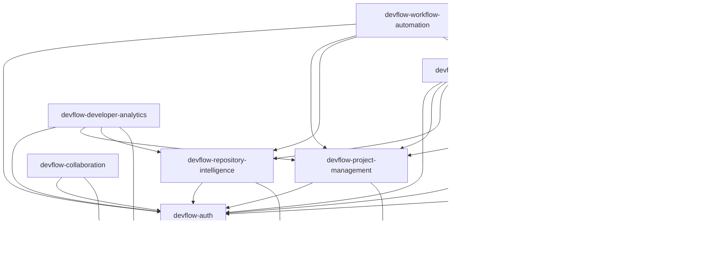

# DevFlow — Module Boundaries Specification

> **Version:** 1.0.0  
> **Status:** Approved / Architecture Review Board (ARB) Signed Off  
> **Author:** Principal Software Architect  
> **Date:** 2026-07-28  
> **Classification:** Internal — Engineering

---

## 1. Purpose

In a Modular Monolith architecture, maintaining strict **Module Boundaries** is critical to preventing the codebase from degrading into a tightly coupled "big ball of mud." This specification translates the conceptual boundaries established in the [Domain Model](file:///Users/apple/Desktop/Namandeep%20Tripathi/My%20Projects/DevFlow-AI/docs/architecture/DOMAIN_MODEL.md) into concrete architectural rules that govern the physical multi-module Maven structure of DevFlow.

Enforcing these boundaries provides several key benefits:
- **Scalability of Development:** Multiple developers or teams can work concurrently on distinct modules without merge conflicts or unexpected side effects.
- **Incremental Compilation & Test Isolation:** Maven can build and test modified modules independently, keeping CI/CD pipelines fast and responsive.
- **Enforced Single Direction of Dependencies:** Circular dependencies are blocked at compile time, preventing spaghetti reference chains.
- **Decomposition Path:** Should any module (such as the resource-intensive AI Engine) require independent scaling, it can be extracted into a standalone microservice with minimal changes, as its database schemas and method dependencies are already isolated.

---

## 2. Module Overview

The DevFlow system is organized into ten distinct Maven modules. Each module represents a Bounded Context or a shared infrastructure layer.

```
devflow/ (Root Maven Project)
├── devflow-shared-kernel/             # Common base abstractions, events, and value objects
├── devflow-auth/                      # Authentication, tenant validation, security policies (RBAC)
├── devflow-project-management/       # Planning, cycles, boards, epics, and task management
├── devflow-repository-intelligence/   # Git synchronization, commit history parsing, PR tracking
├── devflow-ai-engine/                 # LLM client orchestration, prompt templating, vector searches
├── devflow-knowledge-base/            # Wiki documentation, categorization, page histories
├── devflow-developer-analytics/       # Productivity analytics, cycle speeds, and DORA scores
├── devflow-workflow-automation/       # Custom triggers, conditional rule evaluations, automated tasks
├── devflow-collaboration/             # Threaded commenting, reactions, and contributor mentions
└── devflow-notifications/             # Multi-channel notification delivery (In-app, Slack, Email)
```

---

## 3. Module Responsibilities

This section details the purpose, capabilities, owned Aggregate Roots, public interfaces, internal structures, and external integrations for each Maven module.

### 3.1 devflow-auth
- **Purpose:** Manages the identity, registration, workspace membership, and authorization scopes of all users.
- **Business Capabilities:** Core registration, login session issuance, tenant logical resolution, and third-party OAuth connection configurations.
- **Owned Aggregates:** `User`, `Organization` (Workspace).
- **Public API Exposed (`com.devflow.auth.api`):**
  - `AuthApi`: Inter-module security validations (e.g., verifying user authorization scopes for a target workspace).
  - `TenantResolutionApi`: Resolves the active tenant context for incoming calls.
  - `OAuthProviderRegistry`: Retreives authorized credentials for third-party Git provider connections.
- **Internal Components:** User signup validation flows, security filter configuration, JWT token generators, and cryptography helpers.
- **External Systems:** Transactional mailers (SendGrid/Resend) for validation links, corporate identity managers (Okta/SAML).

### 3.2 devflow-project-management
- **Purpose:** Manages the execution, tracking, and organization of tasks and software development boards.
- **Business Capabilities:** Boards construction, vertical lane definitions, cycle duration tracking, epic configurations, and task lifecycle execution.
- **Owned Aggregates:** `Project`, `Task` (Task is a standalone Aggregate Root to avoid write contentions on large boards).
- **Public API Exposed (`com.devflow.pm.api`):**
  - `ProjectManagementApi`: Allows other modules to query project keys, task configurations, and active cycles.
  - `TaskQueryApi`: Read-only queries for task statuses, assignees, and project metrics.
- **Internal Components:** Task state machine validation, automatic task key generators, and cycle transition managers.
- **External Systems:** None.

### 3.3 devflow-repository-intelligence
- **Purpose:** Ingests and compiles code repository commits, files history, and pull request events.
- **Business Capabilities:** Repository mirroring, webhook signature validation, commit parsing, code changes line counting, and code review dispatching.
- **Owned Aggregates:** `Repository`.
- **Public API Exposed (`com.devflow.repo.api`):**
  - `RepositoryIntelligenceApi`: Provides access to repository sync statuses, commit logs, and pull request reviews.
- **Internal Components:** Git metadata parsers, JGit clone engines, batch commit indexers, and webhook signature verifiers.
- **External Systems:** Third-party Git providers (GitHub App APIs, GitLab API v4, Bitbucket API).

### 3.4 devflow-ai-engine
- **Purpose:** Centralized engine orchestrating large language model (LLM) communications and semantic indices.
- **Business Capabilities:** Context-aware prompts construction, RAG semantic searches, chat history logging, and vector embedding indexing.
- **Owned Aggregates:** `ChatSession`.
- **Public API Exposed (`com.devflow.ai.api`):**
  - `AiOrchestrationApi`: Exposes endpoints for executing contextual code reviews, task classifications, and interactive assistant chats.
- **Internal Components:** Prompt templates formatter, vector db similarity resolver, prompt cache managers, and streaming emitter managers.
- **External Systems:** LLM Providers (OpenAI API, Anthropic Claude API, Google Gemini, local self-hosted Ollama runtimes).

### 3.5 devflow-knowledge-base
- **Purpose:** Manages documentation wikis and files attachment associations.
- **Business Capabilities:** Rich text page editing, revision auditing, folders navigation, and semantic document ingestion.
- **Owned Aggregates:** `Document`.
- **Public API Exposed (`com.devflow.kb.api`):**
  - `KnowledgeBaseApi`: Exposes document details, paths, and content revisions.
- **Internal Components:** Markdown parser, folder hierarchy builders, document change-log compilers, and asset storage wrappers.
- **External Systems:** Object stores (MinIO locally, AWS S3/Cloudflare R2 in production environments).

### 3.6 devflow-developer-analytics
- **Purpose:** Compiles historical developer activities and delivery metrics.
- **Business Capabilities:** DORA metrics calculation, task velocity analysis, sprint throughput tracking, and individual activity summaries.
- **Owned Aggregates:** `MetricSnapshot` (analytical read-only projection).
- **Public API Exposed (`com.devflow.analytics.api`):**
  - `DeveloperAnalyticsApi`: Provides analytics results and snapshots for user dashboards.
- **Internal Components:** Aggregation query builders, historical metrics indexer, and statistical calculator.
- **External Systems:** None.

### 3.7 devflow-workflow-automation
- **Purpose:** Evaluates system events to trigger and execute automated, conditional workflows.
- **Business Capabilities:** Trigger monitoring, Boolean expression evaluations, and cross-module mutation routing.
- **Owned Aggregates:** `AutomationRule`.
- **Public API Exposed (`com.devflow.automation.api`):**
  - `WorkflowAutomationApi`: Exposes CRUD structures for rules.
- **Internal Components:** Condition parser, execution loggers, trigger router, and rule state cache.
- **External Systems:** Outgoing generic webhooks (HTTP POST dispatches to external URLs).

### 3.8 devflow-collaboration
- **Purpose:** Manages nested discussions, reactions, and developer mentions.
- **Business Capabilities:** Chat/comment threads construction, emoji reactions logging, and user mentions extraction.
- **Owned Aggregates:** `CommentThread`.
- **Public API Exposed (`com.devflow.collaboration.api`):**
  - `CollaborationApi`: Exposes discussion threads, counts, and reactions details for target resource IDs.
- **Internal Components:** Mention parser, nested comment thread ordering logic, and reaction registers.
- **External Systems:** None.

### 3.9 devflow-notifications
- **Purpose:** Manages delivery routing and preference filtering for alerts.
- **Business Capabilities:** Channel prioritization, HTML template compiling, and user preference enforcement.
- **Owned Aggregates:** `Notification`, `NotificationPreference`.
- **Public API Exposed (`com.devflow.notifications.api`):**
  - `NotificationDispatchApi`: Sends transactional system alerts to users.
- **Internal Components:** Template engines, user preference resolvers, and dispatch executor pools.
- **External Systems:** Email services (SendGrid/Resend/AWS SES), Collaboration platforms (Slack App API, Discord Webhooks, MS Graph API).

---

## 4. Module Dependency Rules

To prevent code modularity from breaking down, compile-time dependencies between Maven modules must be strictly unidirectional.

### 4.1 Dependency Matrix

The table below defines the compile-time dependencies allowed between Maven modules.  
- **Row** represents the target module.
- **Column** represents the dependency.
- **"Yes"** indicates a compile-time dependency is allowed.
- **"No"** indicates a compile-time dependency is strictly prohibited.

| Target Module | `kernel` | `auth` | `pm` | `repo` | `ai` | `kb` | `analytics` | `automation` | `collab` | `notif` |
| :--- | :---: | :---: | :---: | :---: | :---: | :---: | :---: | :---: | :---: | :---: |
| **`devflow-shared-kernel`** | — | No | No | No | No | No | No | No | No | No |
| **`devflow-auth`** | Yes | — | No | No | No | No | No | No | No | No |
| **`devflow-project-management`** | Yes | Yes | — | No | No | No | No | No | No | No |
| **`devflow-repository-intelligence`**| Yes | Yes | No | — | No | No | No | No | No | No |
| **`devflow-ai-engine`** | Yes | Yes | Yes | Yes | — | Yes | No | No | No | No |
| **`devflow-knowledge-base`** | Yes | Yes | Yes | No | No | — | No | No | No | No |
| **`devflow-developer-analytics`** | Yes | Yes | Yes | Yes | No | No | — | No | No | No |
| **`devflow-workflow-automation`** | Yes | Yes | Yes | Yes | Yes | No | No | — | No | Yes |
| **`devflow-collaboration`** | Yes | Yes | No | No | No | No | No | No | — | No |
| **`devflow-notifications`** | Yes | Yes | No | No | No | No | No | No | No | — |



### 4.2 Prohibited and Forbidden Dependencies
1. **No Circular Dependencies:** A Maven module must never participate in a loop (e.g., `devflow-project-management` depending on `devflow-repository-intelligence` while `devflow-repository-intelligence` depends on `devflow-project-management`). If compile-time data sharing is needed, it must be resolved via domain events, a shared kernel model, or a clean boundary extraction.
2. **Core Isolation:** Core modules (`devflow-auth`, `devflow-project-management`, `devflow-repository-intelligence`) must never declare dependencies on downstream consumer modules (`devflow-developer-analytics`, `devflow-workflow-automation`, `devflow-collaboration`, `devflow-notifications`). Downstream side effects must occur via event publishers.
3. **Decoupled Collaboration:** The `devflow-collaboration` module is a generic utility. It must never depend compile-time on target modules (`devflow-project-management`, `devflow-repository-intelligence`, `devflow-knowledge-base`). Instead, comment threads are associated with targets via target types and entity IDs.
4. **Decoupled Notifications:** The `devflow-notifications` module must never depend on any business modules besides `devflow-auth` (for resolving user settings and notification destinations). It receives all dispatch parameters inside the event context published by other modules.

---

## 5. Communication Rules

Communication between modules must follow strict architectural patterns to prevent runtime failures and compile-time leakage.

### 5.1 Synchronous Method Calls (Direct Public APIs)
- **Pattern:** Injecting a Spring service that implements a public interface exported in the target module's API package (e.g. `AuthApi`).
- **When to Use:**
  - **Security and Access Control validations:** Verifying permission policies synchronously before starting an operation (e.g., `PM` asking `AuthApi` to validate workspace permissions).
  - **Atomic, consistent read operations:** Resolving the state of an external entity that is necessary to complete a transaction (e.g., `KB` checking if `ProjectId` exists before creating a document).
- **Rule:** A module can only import and invoke classes located in another module's explicit API package (e.g., `com.devflow.modules.X.api`). Accessing internal service implementations or database repositories directly is forbidden.

### 5.2 Asynchronous Domain Events (Internal Event Bus)
- **Pattern:** Emitting an event using Spring's `ApplicationEventPublisher`. Downstream listeners intercept these events using `@EventListener` (synchronous, in-transaction execution) or `@TransactionalEventListener` with `@Async` (asynchronous execution after transaction commits).
- **When to Use:**
  - **Decoupled downstream updates:** Triggering side effects in other contexts where immediate consistency is not required (e.g., `PM` publishes `TaskCreatedEvent`, and `Notifications` routes alerts asynchronously).
  - **Cross-module notifications and audits:** Populating search indices in Elasticsearch, updating metrics in Developer Analytics, or logging rule executions in Workflow Automation.
- **Rule:** Event structures must be declared in the publishing module's public API package or, if universally shared, in the `devflow-shared-kernel`. Event payloads should carry the primary entity ID and essential metadata, encouraging downstream modules to query details using public API interfaces if necessary.

### 5.3 Shared Kernel Models
- **Pattern:** Using shared base structures, common value objects, or exception definitions declared in `devflow-shared-kernel`.
- **When to Use:** Sharing basic value containers and exceptions that are universal to the platform (e.g., passing a `TenantId` parameter or throwing an `EntityNotFoundException`).
- **Rule:** Do not place domain-specific logic, Maven dependencies, database configurations, or core entities inside the Shared Kernel.

---

## 6. Shared Kernel

The `devflow-shared-kernel` acts as a common foundation. To prevent it from becoming a catch-all folder of coupled code, strict inclusion and exclusion rules apply.

### 6.1 Allowed Elements
- **Base Domain Abstractions:** Core templates like `BaseEntity`, `AggregateRoot` marker, and the `DomainEvent` base structure.
- **Universal Value Objects:** Domain-agnostic value structures, including:
  - `TenantId` / `OrganizationId` (identifying the active workspace tenant).
  - `UserId` (identifying a platform user).
  - `EmailAddress` (standardized email string container).
  - `DateRange` (simple start and end date container).
- **Common Exceptions:** System-wide exception definitions, such as:
  - `BusinessException` (base exception for rule violations).
  - `EntityNotFoundException` (thrown when database resources do not exist).
  - `UnauthorizedException` (thrown when security validations fail).
- **Core Interfaces:** Shared engine interfaces (e.g., custom event publisher interfaces).

### 6.2 Prohibited Elements (NEVER Place in Shared Kernel)
- **Domain Entities:** Concrete business representations (e.g., `Task`, `Commit`, `Document`, `User`).
- **Business Logic Services:** Processing pipelines (e.g., `TaskService`, `CommitParser`).
- **Database Schema and Configuration:** Spring Data JPA repositories, Hibernate configurations, or database migration scripts (Liquibase/Flyway).
- **Presentation Layer Classes:** Spring MVC REST controllers, DTOs, or websocket handlers.
- **Third-party integrations:** API clients or wrappers (e.g., JGit instances, SendGrid libraries).

---

## 7. Cross-Cutting Concerns

Cross-cutting concerns must be managed centrally without creating tight coupling between domain modules.

### 7.1 Security
- Spring Security is configured centrally in the application entry module.
- It intercepts incoming requests, validates JWT claims, and populates the `SecurityContextHolder`.
- Domain modules enforce security checks declaratively using `@PreAuthorize("hasPermission(#projectId, 'project:write')")`. The implementation details of the permission check are handled by a central security adapter, keeping the domain modules independent of spring security configurations.

### 7.2 Validation
- Request validation is handled using the standard **Jakarta Bean Validation** API (annotations like `@NotNull`, `@Size`, `@Email`).
- Validation annotations are applied directly to incoming DTO structures at the module boundary.
- A global exception handler captures validation failures and translates them into structured error responses.

### 7.3 Logging
- Log output is handled using the **SLF4J** interface backed by **Logback**.
- Modules must never configure files or log outputs individually. A central configuration file (`logback-spring.xml`) in the execution module dictates output formats (JSON) and delivery destinations (Grafana Loki).
- Trace identifiers (W3C traceparent headers) are automatically injected into the logging Mapped Diagnostic Context (MDC) to trace asynchronous invocations.

### 7.4 Observability
- Application metrics and traces are gathered using **Micrometer** and **OpenTelemetry**.
- Core instrumentation (JVM stats, database pool monitoring) is configured globally by Spring Boot Actuator.
- Domain modules track business metrics (e.g., tasks completed, prompt tokens consumed) by injecting `MeterRegistry` and logging counters or timers, keeping instrumentation decoupled from the telemetry shipping infrastructure.

---

## 8. Architectural Rules

To ensure long-term maintainability, the following architectural rules are mandatory. Any violation must fail the build.

1. **No Circular Dependencies:** Circular relationships between Maven modules are strictly prohibited.
2. **Schema Logical Separation:** Database tables must be partitioned into logical schemas corresponding to the respective module boundaries (e.g., `auth`, `pm`, `repo`, `ai`). Direct database joins or cross-schema queries are forbidden. If a query requires data from multiple modules, it must be performed using in-process API method calls or read-only materialized views managed in the search engine (Elasticsearch).
3. **Public API Enclosure:** All business logic services, entities, and JPA repositories must be declared with package-private access (no `public` modifier) to prevent external modules from referencing them. Only the interfaces and DTOs declared in the module's public API package (`com.devflow.modules.X.api`) can be public.
4. **No Direct Thread Spawning:** Spawning raw threads or invoking `new Thread()` is forbidden. All asynchronous tasks must run through Spring-managed Task Executors (`@Async("threadPoolName")`) with bounded thread pools configured in the central runner module.
5. **Spring Modulith Verification:** Boundary rules must be verified in the test suite using **Spring Modulith**. The test suite will inspect the class graph, failing the build if a module references package-private classes or forbidden dependencies in other contexts:
   ```java
   class ArchitectureBoundariesTest {
       @Test
       void verifyModularity() {
           ApplicationModules.of(MonolithicApplication.class).verify();
       }
   }
   ```
6. **Stateless Domain Logic:** Service layers must remain completely stateless. Shared session contexts must be resolved through Spring Security and the Tenant Context thread-local holders.

---

## 9. Future Evolution

The modular design of DevFlow ensures new domains can be added with minimal impact on existing features.

Adding a new module involves:
1. **Declare Maven Submodule:** Create a new folder (e.g., `devflow-billing`) with a `pom.xml` declaring `devflow-shared-kernel` as a dependency.
2. **Isolate Database Schemas:** Define a new schema in PostgreSQL (e.g., `billing`). Database tables and migrations must be isolated within this schema.
3. **Define Public API Contract:** Create a public package `com.devflow.billing.api` containing the API interfaces and event DTOs.
4. **Integrate via Events:** Subscribe to events published by existing modules (e.g., subscribing to `OrganizationCreatedEvent` to initialize billing accounts) without modifying the code of the publishing module.
5. **Verify Modularity:** Run the Spring Modulith test suite. The framework will automatically detect the new module and verify that it adheres to all dependency boundaries.
